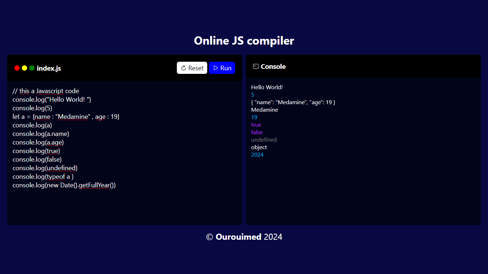

# Online Js compiler 
this a simple online js compiler using html css & js , that simulate the `console.log()` methode 
## installation 
1 - clone or download repo 
```bach
git clone https://github.com/ourouimed/online-js-compiler.git
```
2 - open index.html file
## Features
- code Editor : js code editor input
- custom console : highlited `console.log()` output & Errors 
- Run & Reset code
- & more comming soon ...
## Live demo 

to see live demo please visit [live demo](https://ourouimed.github.io/online-js-compiler)
